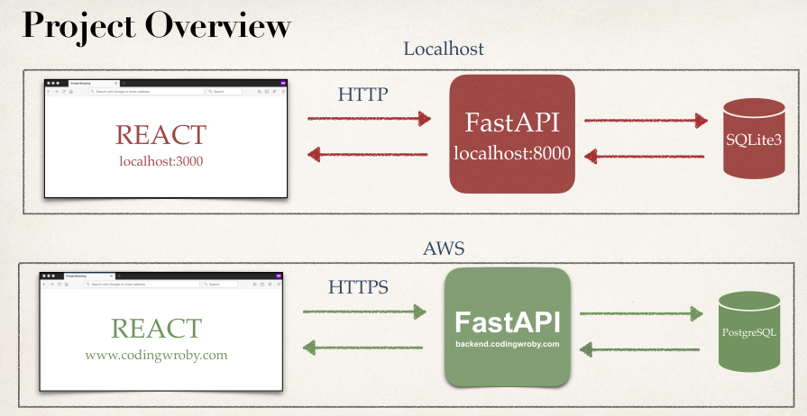
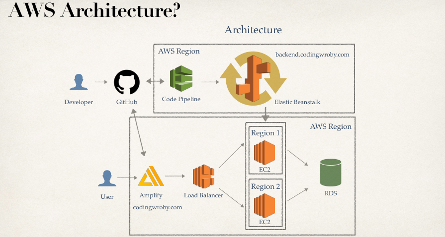

# React + Vite Example

  Course Udemy Deploy a Full Stack app on AWS that is scalable, uses a custom domain, SSL, HTTPS, Continuous Integration and Delivery  

## Project Overview

## AWS Architecture

## Technologies - Run Project Locally & Course Setup

- React & Vite

    React and Vite are often used together to create modern web applications due to their complementary strengths. Vite is a build tool that provides a faster and leaner development experience for modern web projects, while React is a JavaScript library for building user interfaces.

### Accomplishments

- Deploy FastAPI + PostgreSQL application
- Setup CI/CD
- Setup Custom Domain
- Setup SSL / HTTPS
- Create Load Balancer for our FastAPI application
- Deploy React application
